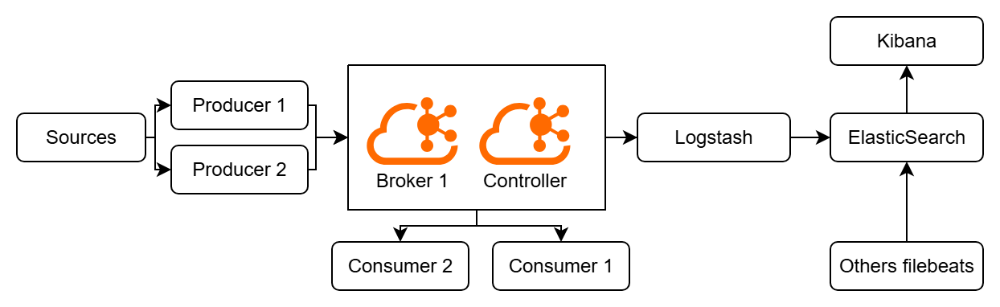

# Kafka with ELK
練習用架構

## Architecture


## Commands
For bash
``` bash
docker-compose \
-f docker-compose.logstash.yaml \
-f docker-compose.kibana.yaml \
-f docker-compose.kafka.yaml \
-f docker-compose.elastic.yaml \
-f docker-compose.kafkaui.yaml \
-f docker-compose.networks.yaml \
up
```
For Powershell
``` powershell
docker-compose `
-f docker-compose.logstash.yaml `
-f docker-compose.kibana.yaml `
-f docker-compose.kafka.yaml `
-f docker-compose.elastic.yaml `
-f docker-compose.kafkaui.yaml `
-f docker-compose.networks.yaml `
up
```

## TODO
- [ ] 異步任務池設計
- [ ] 多節點HA
- [ ] 還在想...